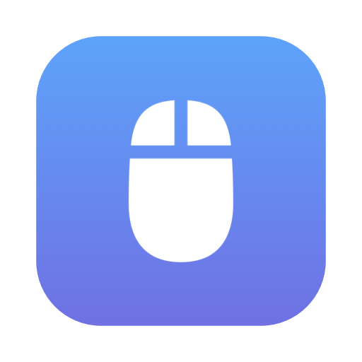
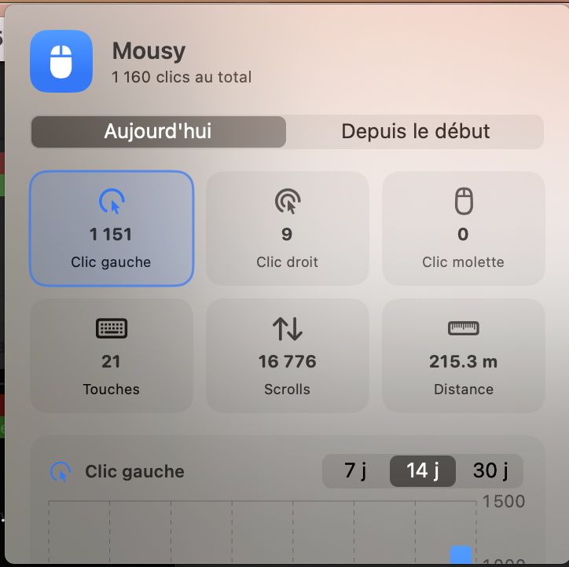
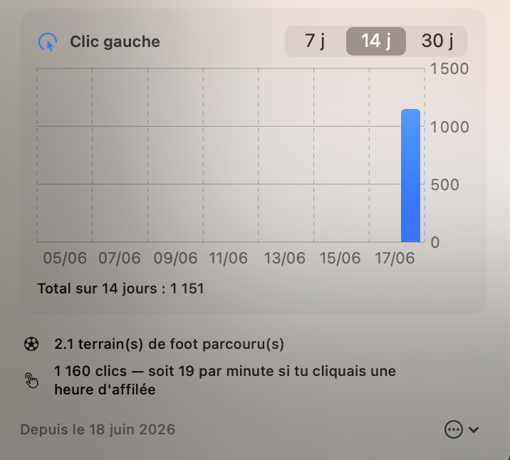

<div align="center">



# Mousy

**Your Mac's input, as fun stats.**

A tiny native macOS menu-bar app that quietly counts your clicks, keystrokes,
scrolls and the distance your mouse travels — then shows it all in a clean panel
with day-by-day charts.

[](https://www.apple.com/macos/)
[](https://swift.org)
[](https://developer.apple.com/xcode/swiftui/)
[](LICENSE)
[](#-privacy)

</div>

---

## ✦ Overview

Mousy lives in your menu bar — no Dock icon, no window clutter. Click its icon and
you get a snapshot of how much you've been clicking and typing, both **today** and
**all-time**, with a bar chart breaking every stat down day by day.

It's a fun little "quantified self" toy for your peripherals. Everything stays on
your machine.

<div align="center">


&nbsp;


</div>

## Features

- 🖱️ **Tracks everything** — left clicks, right clicks, middle (wheel) clicks,
  keystrokes, scroll events, and **mouse distance traveled** (converted to real
  cm / m / km using your display's physical size).
- 📅 **Today & all-time** — a daily counter that resets at midnight, plus lifetime totals.
- 📊 **Day-by-day charts** — pick any stat and view its history over **7 / 14 / 30 days**.
- 🎨 **Native & clean** — built with SwiftUI `MenuBarExtra` and SF Symbols, one accent color per stat.
- 🧮 **Fun facts** — football fields walked by your cursor, pages typed, and more.
- 🔒 **Private by design** — no network, no telemetry, no account. Data never leaves your Mac.

## 🔒 Privacy

Mousy **only counts events** — it never records *what* you type or *where* you click.
No key contents, no screen contents, nothing leaves your computer. All data is a
handful of integers stored locally at:

```
~/Library/Application Support/Mousy/stats.json
```

Delete that file (or use **Reset stats** in the app) to wipe everything.

## Requirements

- macOS 13 (Ventura) or later
- Xcode 15+ / Swift 5.9+ (only to build)

## Build & Run

```bash
git clone git@github.com:telenc/mousy.git
cd mousy
./build.sh          # compiles + bundles + ad-hoc signs Mousy.app
open Mousy.app
```

Prefer a quick dev run without bundling:

```bash
swift run            # runs straight from sources
```

To install it like a real app:

```bash
cp -R Mousy.app /Applications/
open /Applications/Mousy.app
```

## ⌨️ Permissions

| Input | Permission required | Why |
|-------|--------------------|-----|
| Mouse clicks, scroll, movement | **None** | Mouse events are observable without authorization |
| Keyboard | **Input Monitoring** | macOS gates global keystroke monitoring |

On first launch macOS prompts for **Input Monitoring**. If keystrokes stay at `0`:

1. Open **System Settings → Privacy & Security → Input Monitoring**
2. Enable **Mousy** (the panel has a shortcut button for this)
3. Quit and relaunch Mousy

> **Note:** the build is ad-hoc signed, so its signature changes on every rebuild and
> macOS may ask for the permission again. Keep a built `Mousy.app` around and you'll
> only grant it once.

## Launch at login (optional)

**System Settings → General → Login Items → +** → add `Mousy.app`.

## How it works

| File | Responsibility |
|------|----------------|
| `MousyApp.swift` | App entry point — SwiftUI `MenuBarExtra`, agent app (no Dock icon) |
| `EventMonitor.swift` | Global `NSEvent` monitors for mouse + keyboard, Input Monitoring request |
| `StatsStore.swift` | Per-day records, distance→meters conversion, JSON persistence, migration |
| `StatsView.swift` | The menu-bar panel: cards, charts (Swift Charts), fun facts |

Mouse distance is accumulated in screen points, then converted to meters using
`CGDisplayScreenSize` (physical mm) and the display's backing scale — so the km
figure reflects real-world travel, not pixels.

## Roadmap

- [ ] Cumulative / streak views
- [ ] "Record day" highlight & achievements
- [ ] CSV / JSON export of history
- [ ] Optional live counter in the menu-bar title
- [ ] App icon & screenshots

## Contributing

Issues and PRs welcome. Keep it small, native, and privacy-respecting.

```bash
swift build      # debug build
swift run        # run from sources
```

## License

[MIT](LICENSE) © Rémi Telenczak ([@telenc](https://github.com/telenc))
